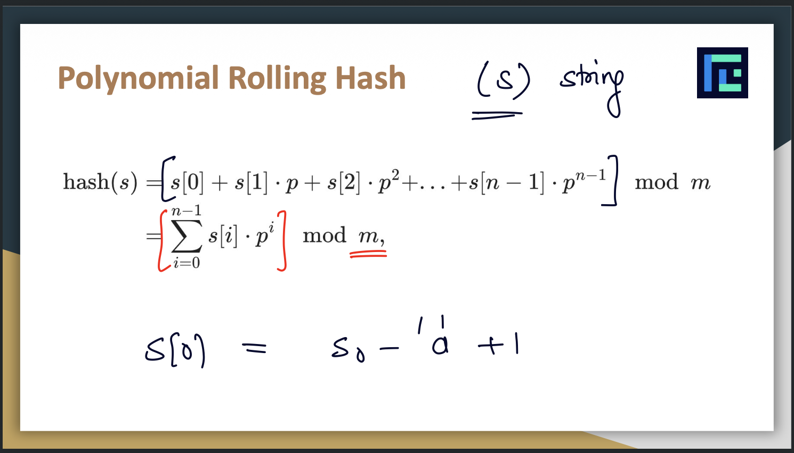

Binary Search
----------------
- Binary search is an efficient algorithm for finding a target value in a sorted array. Instead of checking every element one by one, it repeatedly cuts the search space in half (left + (right-left)/2).
- The array MUST be sorted
- why left + (right-left)/2 is best?
    - (left+right)/2 with large positive number can cause integer overflow
    - right - left is always a small, positive number (just the gap between them)
    - Dividing that by 2 makes it even smaller
    - Adding it back to left never exceeds right

- Time Complexity 
    - How many steps to find target in n array
        - n -> n/2 -> n/4 -> n/8 ......... -> 1
        - n/2^k = 1
        - k = log n
    - Recurrence relation
        T(n) = T(n/2) + 1
        T(1) = 1
    - O(log n)

- Binary serach can not only apply on sorted array but also on
    - Monotonically Increasing Functions
    - Monotonically Decreasing Functions

- Meaning of Monotonic
    - X increases, Y increases
    - X increases, Y Decreases

- Two Concepts (Same)
    - Binary search on sorted array
    - Binary serach on functions (Monotonically Increasing or decreasing)

- Predicate function
    - Function that return true or false on every input.
    - These functions are used to check if our inputs meets some condition or not.

- odd no * odd no = odd no
- even no * odd no = even no
- even no * even no = even

- Some mathematical point of view
    - Why odd * odd = odd and even * even = even
    - if x is odd then x = 2k+1, now x^2 = (2k+1)^2 = 4k^2 + 4k + 1 (odd)
    - if x is even then x = 2k, now x2 = 4k2 (even)

Monotonic Predicate Function
  - Lets assume True is 1 and false is 0
  - TTTTTTFFFFF,  FFFFTTTTTTT  is Monotonic Predicate function output
  
Binary Serach on Answer
------------------------

1. There will be monotonic predicate function defined on ordered set (search space)
2. In competitive programming, the main challenge is to find monotonic predicate function.
3. For decimal problems, there will always be mentioned upto how many places after decimal. 
4. For decimal problems one of those condition will be given
    - Correct upto x decimal places
    - Output must have relative error <= y. (|real answer - output (users print)| <= y)
5. If relative error requirement is for y = 10^3 then if we print any answer which is correct upto 4 decimal places will work. 
6. Binary serach on decimal places - we can fix the infinite serach space of decimals into finite by fixing the number of decimal places in the answer.
7. Precision issue - decimal has precision issue. lets assume low = 0 and high = 0.000001 if we find mid then 0.0000005 and we are considering only 6 decimal places. thats why condition of loop will be (high-low > precision) not low <= high
8. To avoid precision issue then find one more decimal places which is given in question
9. Summary to resolve precision issue:
    - if asks for x decimal places then do it for x+1
    - if asks relative error for 10^x then do it for x+1 decimal places
10. With decimal numbers : decimal number is a.b
    - if a is big then b must be small
    - if a is small, then b must be big 
    Note: This problem cannot be solved
11. Number of iterations with integer serach space = log(high-low)
12. Number of iterations with decimal serach space = log((high-low) * precision (10^k))
13. Issue with decimal serach space in which mid become high value, to resolve this just find out total iterations and run loop only equal to number of iterations.
14. To solve the problem of infinite loop - find out the number of iterations before writing code. No need to handle any low <= high

15. Some nice results to know while calculating number of iterations
    - log2(1000) = 10
    - log2(1000*1000*1000) = log2(1000^3) = 10 * 3 = 30
    - loga(b) + loba(c) = loga(b*c)
    - log2(1000*1000) = log2(1000) + log2(1000) = 10 + 10 = 20
    - log2(1000^k) = 10 * k
16. Intersection of two ranges (x1,y1) and (x2,y2) = max(x1,x2) <= min(y1,y2)
17. Two way of binary serach
    - Keep maintain ans variable and left, right updated as mid-1, mid+1 respectively
    - Do not keep ans variable and keep updating left, right as mid and in end right will your answer. Here left points to false and right points to true in monotonic predicate function. 
18. In decimal serach space, if L and R are too close and just relative error apart then its not required to serach mid in between them.

Binary search and Interactive Problems
---------------------------
1. In some questions we need to transform the given array to find the solution 
    Example : 
        - F(x) is true if median of subarray length k is greater than equal to x.
            - transformed equation = ai-x + ai+1 -x ...... ai+k-1 - x >= 0
        - F(x) is true if ratio of k elements is greater than equal to x. 
            - Transformed equation= (ai - bi*x) + (ai+1 - bi+1*x) ....... >=0

Interactive Problems
--------------------------
1. Interactive programming is a style of programming problems where your program communicates with a judge during execution, instead of reading all input at once and printing all output at the end.
2. The interaction looks like a conversation:
    - Your program asks the judge a question.
    - The judge immediately replies.
    - Your program uses that reply to decide the next question.
    - Eventually, your program outputs the final answer.
3. Unlike normal competitive programming:
    * You must flush the output after every query.
    * There is usually a limit on the number of queries.
    * Reading input before sending the required output can cause your program to hang (waiting for input that never arrives).
4. In Interactive problems, we ask questions and get outputs and in end print complete result.
5. In interactive problems, we cant use '/n' becoz we need output for every question to get final result.
6. endl flushes the stream and print whatever supposed to be done but /n it wait to everything build up and once its done it prints everything.
7. fmt.Println() directly writes to os.Stdout. But we should use bufio and explicitly flush()
8. To test interactive problems use custom interactor that will acts as judge.
9. Interactive problems are based on Binary/ternary search or randamization (non-deterministic)
10. Interactive problems are just different way of taking input.
11. For interative problems:
    - Write query functions
    - Implement logic

Sliding Window
-------------------
1. Types
    - Fixed size sliding window
    - Dynamic size sliding window or two pointer

2. Time complexity -> It reduces from O(n^2) to O(n)
3. Useful for array based problems with constant subarray size.
4. When to use - calculating some infi for every fixed length subarray in an array
5. Use of 2 Pointers
6. Useful for interview too
7. If there is subarray of fixed size - then use sliding window.
8. The elements added first in the window will be removed first, so sometimes we can optimize our codes by using queue instead of sets or map.
9. In some questions we will use monotonic increasing or descreasing stack or queue to get the answer.

Two Pointers or Variable size sliding window
-----------------------------------------------
1. Good segment technique 1
    - A segment is called good if sum of its elements is <= k where ai >1
    - It means any subarray of segment is also satisfying condition sum <= k
    - In question usually asked largest
    - If segment [L:R] is good then all segements enclosed in it will be good.
    - Try to keep incresing segment size until it is good
2. Size [l, r] = r-l+1
3. Good Segment technique 2
    - Define a good segment as a subarray that follows a particular property
    - Now, all subarray containing that good segment is also good
    - example define a good segment as subarray whose sum is > k
    - now every subarray containing good segment will also have sum > k
    - In question usually asked shortest.
    - If segment [L:R] is good then all segments enclosing it will be good
    - Try to keep decresing segement size until it is good.

Number Theory
--------------
1. Factorization
    - Factors occurs in pair : p*q = n
    - min(p,q) <= square root of n
    - Now, with above two observation we can iterate over smaller number -> i -> 1 to square root of n
    - 
2. n not equal m it means prime representation of n is not equal to prime representation of m.
3. The smallest factor of a number > 1 is always prime
4. If x is a factor of n, and y is a factor of x then y is a factor of n.
5. Every number can be broken down into prime numbers.
6. First factor of a number is prime. 
7. There can be only 1 prime factor > square root of 1
8. Eratosthenes
    - lets say want to check 10^6 elements are prime or not
    - Create an array of size 10^6 and fill all indexes as 1
    - now start from 2nd index and check if its value is 1 then mark all its square numbers as 0.
9. Harmonic series = sum (n/2+n/3....n/n) => nlogn
10. SPF (Smallest prime factor)
    - lets say want to check 10^6 elements are prime or not
    - Create an array of size 10^6 and fill all indexes as 1
    - now start from 2nd index and check if its value is 1 then mark all its square numbers as 0. Plus store smallest prime factor of that number

11. sum of powers of prime numbers = O(logN)
12. Number & sum of divisors
    - N = p1^e1 * p2^e2 .... pk^ek
    - count of divisors = (e1+1)*(e2+1)*.....(ek+1)
    - sum of divisor = multiplication of sum of all possible powers of prime number (geometric progression formula)
13. x^1+x^2+x^3+.....x^k => Geometric progression
14. Modular Airthmetic
    - (A+B)%M = [(A%M) + (B%M)] % M
    - (A-B)%M = [(A%M) - (B%M) + M] % M
    - (A*B)%M = [(A%M) * (B%M)] % M
    - (A/B)%M = [(A%M) + (B^-1 % M)] % M  here B^-1%M is Modular Inverse
    - a%b = [0 ... b-1] here mod is just repeated subtraction
    - mod can not be negative value
15. Binary Exponantiation
    - a^b => ?
    - write power b in form of binary i.e a^7 = a^111 = a^(2^0 + 2^1 + 2^2 )
        - here max power of 2 can be (log b) i.e 2^p >= b take log both side
    - a^1 ---> a^2 (a^1*a^1)----> a^4 (a^2*a^2)-----> a^8 (a^4*a^4)
    - needs to iterate over bits of power 
16. Euclidean Algorithm
    - gcd (a,b) = a if b = 0 otherwise gcd(b, a mod b) 
        - here gcd is greatest common divisor
    - Time complexity = O(log(min(a,b)))
    - a%b <= a/2
    - GCD(a,b) = GCD(b,a)
    - GCD(a,0) = a
    - GCD(a,b,c) = GCD(GCD(a,b),c) = GCD(a, GCD(b,c)) = GCD(b, GCD(a,c))
    - GCD(a,b) >= GCD(a,b,c) >= GCD(a,b,c,d)
    - GCD contains minimum power of primes
    - LCM contains maximum power of primes
    - GCD(a,b) * LCM(a,b) = a*b
17. Euler's Totient Function & Fermat's Theorem
    - Euler's Totient function of (n) = number of coprime numbers between 1 to n
    - a^$(m) % m = 1%m --> Euler's theorem
    - gcd(a,m) = 1
    - now, when m is prime then a^m-1 %m = 1%m here $(m) = m-1 when m is prime ---> fermat's little theorem

18. Powers are cyclic. Mod repeates at every m numbers
    - a^b % m = a^b%m-1 % m

19. Combinatorics & Probability
    - Combinatorics
        - Binomial Coefficients - ways to choose
            - Number of ways to choose k items from n items
            - (n,k) = n!/k!(n-k)!
            - When order of picking k items does not matter - 1,2,3 or 3,2,1 both are same
            - create an array to store i! 
            - create an array to store (1/i)!
        - 2 different use cases
            - calculate C(n,r) many times with O(n) pre-computation and O(1) calculation of each query.
            - Calculate C(n,r) just once in O(r) time
        - Important Binomial Results
            - C(n,k) = C(n, n-k)
            - C(n,k) = C(n-1, k-1) + C(n-1, k). => Pick or dont pick it => DP
            - summation(k=0 to n) C(n, k) = 2^n
            - k items always included - C(n,r) = C(n-k, r-k)
            - k items are never included - C(n,r) = C(n-k, r)
            - Value of C(n,r) is greatest when r = n/2
        - Arrangements
            - Arrange distinct elements - n!
            - Arrange similar elements - ((a1+a2+a3+....+an)!)/a1!*a2!*a3!...an!  here a1,a2 are number of occurrences of each type.

20. String Hashing
    - Optimizes Brute force solutions
    - Help in comparing two strings
    - Daddy of string algos
    - if a == b then Hash(a) = Hash(b)
    - strings are not compared in O(1) like integers
    - X (string). -> Hash(x). -> Unique integer representation of x that we can store
    - Logic step by step
        - store each character of string in a list of character
        - assume all character are lower case now convert this list into interger list - xi - 'a'
        - now multiply each number from interger list by power of 26. as integer can range from 0 to 25
    - there are 10^18 size to store an integer. 
    - strings are infinite -> Calculated Unique interger will be infinite - but to store them we have finite 10^18. So it could be possible two different strings map to same interger. But its probability is very low.
    - if two strings are different A != B, Hash(A) != Hash(B) but f(Hash(A)) can be equal to f(Hash(B)) because f(y) = y % 10^15, here f(y) is a function that maps to huge unique interger to storable integer.
    - Probabilty of (x%M = y%M) = 1/M as per above example
        - P((Hash(A)%10^15) = (Hash(B)%10^15)) = 1/10^15

        
    - To check A == B we just need to check hash(A) = Hash(B)
    - To check A > B or A < B we know hash(A) != Hash(B), we can use binary serach to find character where two strings different.
    - to calcuate hash of substring of string A in constant time - use pre hash logic

21. Tries
    - String Tries
        - Tries != Trees
        - Initially to answer Q queies on N strings - we use binary serach and Hashing
        - Tries help to move precomputation time complexity almost O(1) and querie computation time complexity to almost O(1)
        - Trie will have edges connected for input string, The node at which strings end will have counter (string_ends_with) to find count of strings which is equal to X and node will have second counter (string_ending_below) to identify number of strings has some prefix X. 
        - A trie (prefix tree) is a tree-based data structure used to store and search strings efficiently, especially when you care about prefixes.
        - branch factor of each node is 26
        
    - % = approx 5 extra operations
    - Space complexity of trie
        - All Unique strings of length L (40) = 26^40
        - Lets assume we have N = 10^6 and L = 40, 
        - overestimate space complexity = N.L.26 = 10^6*40*26
        - actual = 26 + 26^2 + 26^3 + 26^4  + 26^5 + 10^6*36*26
        - Now, overestimate is 8 times larger than actual
    - Binary Tries
        - Represent decimal numbers in binary, and insert their bits in trie
        - branch factor is 2
        - Two way
            - MSB to LSB - have little problem, pre hand we dont know th depth of trie
                - solution- each binary representation will be same number of bits.
            - LSB to MSB - No extra bit is needed in this
        - use in deterministic approch where you are sure where to go

22. Greedy Algorithm
    - Greedy strategy is that assumes that the best answer can be found using some possibilities and only tries those limited possibilities.
    - It involves coming up with a claim (greedy) and then proving it. 
    - How to prove greedy strategy 
        - Formal (Simple math) (everyone understand and believe) [Best Approch] or intuitive proof (You understand and you believe) [Third best approach]
        - Trying out too many cases and failing to disaprove (everyone understand but only you believe) [Second best approach]

    - Hint - Create greedy solution then create other solution from greedy solution and try to proof other solution will not work.
    - Greedy strategy works in one problem but might not work in another type of problem
    - 99% Greedy problems need sorting so check constraints that O(nlogn) is applicable or not.

   - Whenever question has find minimum or maximum of something try to thing of monotonic.
        

